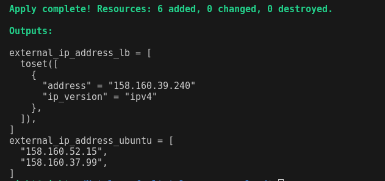
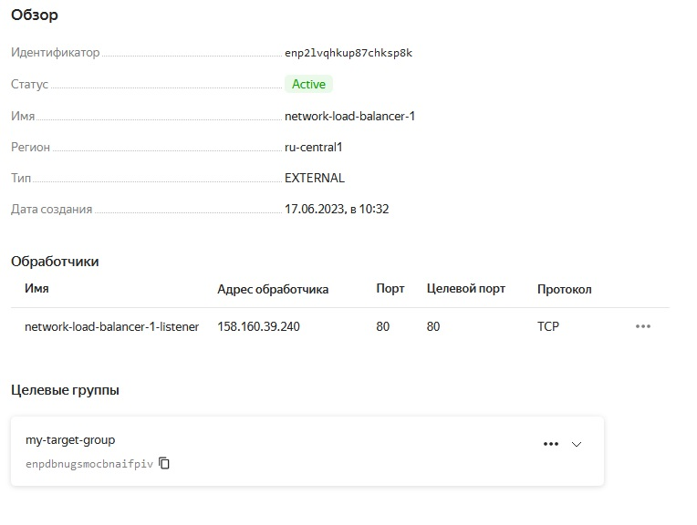

# Отказоустойчивость в облаке
## Домашнее задание. Горбунов Владимир

## Цель задания
1. Конфигурировать отказоустойчивый кластер в облаке с использованием различных функций отказоустойчивости. 
2. Устанавливать сервисы из конфигурации инфраструктуры.

## Содержание

- [Задание 1. Yandex.Cloud. Terraform, сетевой балансировщик](#Задание-1)
- [Задание 2. Yandex.Cloud. Группы ВМ, автоматизация установки nginx](#Задание-2)  


## Задание 1
> Возьмите за основу [решение к заданию 1 из занятия «Подъём инфраструктуры в Яндекс Облаке»](https://github.com/netology-code/sdvps-homeworks/blob/main/7-03.md#задание-1).

> Теперь вместо одной виртуальной машины сделайте terraform playbook, который: </br>

> создаст 2 идентичные виртуальные машины. Используйте аргумент [count](https://www.terraform.io/docs/language/meta-arguments/count.html) для создания таких ресурсов; </br>
создаст [таргет-группу](https://registry.terraform.io/providers/yandex-cloud/yandex/latest/docs/resources/lb_target_group). Поместите в неё созданные на шаге 1 виртуальные машины; </br>
создаст [сетевой балансировщик нагрузки](https://registry.terraform.io/providers/yandex-cloud/yandex/latest/docs/resources/lb_network_load_balancer), который слушает на порту 80, отправляет трафик на порт 80 виртуальных машин и http healthcheck на порт 80 виртуальных машин.</br>
Рекомендуем изучить [документацию сетевого балансировщика нагрузки](https://cloud.yandex.ru/docs/network-load-balancer/quickstart) для того, чтобы было понятно, что вы сделали.

> Установите на созданные виртуальные машины пакет Nginx любым удобным способом и запустите Nginx веб-сервер на порту 80.

> Перейдите в веб-консоль Yandex Cloud и убедитесь, что: </br>
созданный балансировщик находится в статусе Active, </br>
обе виртуальные машины в целевой группе находятся в состоянии healthy.

> Сделайте запрос на 80 порт на внешний IP-адрес балансировщика и убедитесь, что вы получаете ответ в виде дефолтной страницы Nginx. </br>
*В качестве результата пришлите:*</br>
*1. Terraform Playbook.*</br>
*2. Скриншот статуса балансировщика и целевой группы.*</br>
*3. Скриншот страницы, которая открылась при запросе IP-адреса балансировщика.*</br>

- Плэйбук терраформа:</br>
[main-lb-target-group](./main-lb-target-group)</br>
[metadata.yaml](./metadata.yaml)</br>
[variables.tf](./variables.tf)

два хоста создаются с применением аргумента count
```
resource "yandex_compute_instance" "ubuntu" {
  count = 2
  name = "ubuntu${count.index}"
  ...
}
```
создание lb таргет группы:
```
resource "yandex_lb_target_group" "target_group1" {
  name      = "my-target-group"
  dynamic "target" {
    for_each = yandex_compute_instance.ubuntu
    content {
      subnet_id = yandex_vpc_subnet.subnet-1.id
      address   = target.value.network_interface[0].ip_address
    }
  }
}
```
и сетевого балансировщика:
```
resource "yandex_lb_network_load_balancer" "lb-1" {
  name = "network-load-balancer-1"

  listener {
    name = "network-load-balancer-1-listener"
    port = 80
    external_address_spec {
      ip_version = "ipv4"
    }
  }

  attached_target_group {
    target_group_id = yandex_lb_target_group.target_group1.id

    healthcheck {
      name = "http"
      http_options {
        port = 80
        path = "/"
      }
    }
  }
}
```
1й вариант установки nginx - после создания машин запускаем плэйбук ансибла:</br>
[ansible-nginx.yml](./ansible-nginx.yml)

2й вариант установки nginx - сразу же терраформом передаём яндексу параметры с помощью #cloud-config. На мой взгляд самый простой вариант:</br>
[metadata.yaml](./metadata.yaml)
```
#cloud-config
...
...
...
package_update: true
package_upgrade: true
packages:
  - nginx
```





## Задание 2
> Теперь вместо создания виртуальных машин создайте [группу виртуальных машин с балансировщиком нагрузки](https://cloud.yandex.ru/docs/compute/operations/instance-groups/create-with-balancer).

> Nginx нужно будет поставить тоже автоматизированно. Для этого вам нужно будет подложить файл установки Nginx в user-data-ключ [метадаты](https://cloud.yandex.ru/docs/compute/concepts/vm-metadata) виртуальной машины.</br>
[Пример файла установки Nginx](https://github.com/nar3k/yc-public-tasks/blob/master/terraform/metadata.yaml).</br>
[Как подставлять файл в метадату виртуальной машины.](https://github.com/nar3k/yc-public-tasks/blob/a6c50a5e1d82f27e6d7f3897972adb872299f14a/terraform/main.tf#L38)

> Перейдите в веб-консоль Yandex Cloud и убедитесь, что: </br>
созданный балансировщик находится в статусе Active,</br>
обе виртуальные машины в целевой группе находятся в состоянии healthy.

> Сделайте запрос на 80 порт на внешний IP-адрес балансировщика и убедитесь, что вы получаете ответ в виде дефолтной страницы Nginx.

> *В качестве результата пришлите*</br>
*1. Terraform Playbook.*</br>
*2. Скриншот статуса балансировщика и целевой группы.*</br>
*3. Скриншот страницы, которая открылась при запросе IP-адреса балансировщика.*</br>

- Плэйбук терраформа:</br>
[main.tf](./main.tf)</br>
[metadata.yaml](./metadata.yaml)</br>
[variables.tf](./variables.tf)

- Nginx установлен передачей параметров в cloud-init:</br>
[metadata.yaml](./metadata.yaml)
```
#cloud-config
...
...
...
package_update: true
package_upgrade: true
packages:
  - nginx
```


По адресу балансировщика отображается страница nginx, в которую скрипт записал имя созданного хоста. 
>echo $(hostname | cut -d '.' -f 1 ) > /var/www/html/index.html

